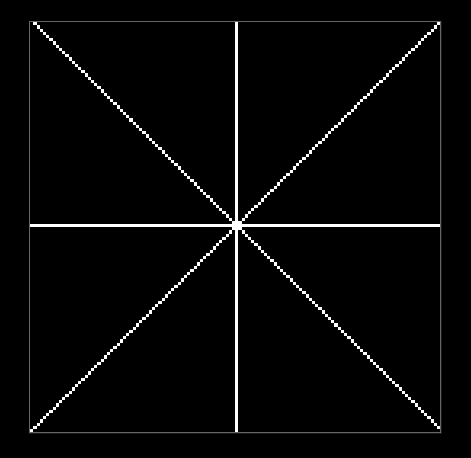
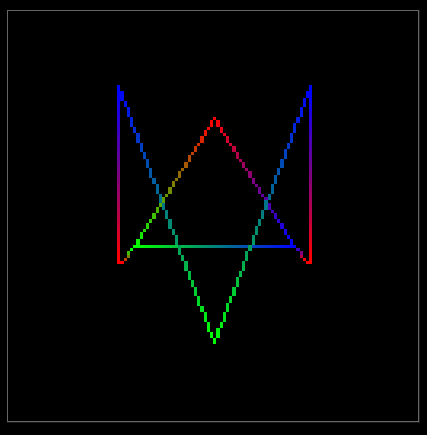
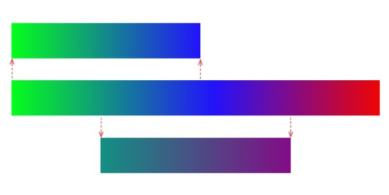
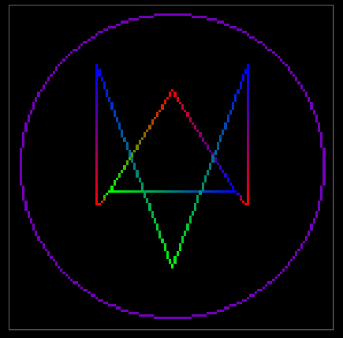

# Atividade Prática 1 - Rasterização de Linhas

**Alunos:** João Victor Rodrigues Galvão (**matrícula:** 20190172620) e Yvson Nunes Figueiredo (**matrícula:** 20190019716) 

A atividade desenvolvida teve como pretensão implementar o algoritmo de Bresenham (ou Algoritmo do ponto médio). Para tal, foram utilizadas a linguagem de programação JavaScript, bem como, uma biblioteca de autoria do professor Christian Azambuja Pagot para colorir pixels.   
Ademais, com o fito de comprovar o funcionamento do algoritmo, foram implementadas as funções  **MidPointLineAlgorithm()** (a qual rasteriza para todos os octantes uma linha dado o ponto inicial e  final e cor inicial e final)  e **DrawTriangle()** (que reaproveita a função anterior tendo como argumentos três pontos e três cores).

## Dicussão dos resultados Gerados

A ideia para a construção da função **MidPointLineAlgorithm()** baseiou-se no algoritmo do ponto médio para rasterização de linhas. Nesse âmbito, o desafio foi apenas generalizar a técnica para todos os octantes, visto que primordialmente, a implementação se baseou em uma abordagem desenvolvida no primeiro octante.   
Assim,  a generalização se deu refletindo todas as linhas contidas no dóminio dos demais sete octantes para o primeiro octante. Para tal, foi observado atráves da análise do ponto inicial e final e do coeficente angular a classificação de um dado segmento de reta. Doravante, a medida que  as tranformações são aplicadas no algoritmo e obtêm-se a saída no domínio do primeiro octante, é feito a tranformação inversa para o octante original. 

 

<b> Figura 1: Primeiro teste de validação</b>

No tocante ao preenchimento das cores da linha, foi utilizado a técinca de interpolação linear. A implementação utilizou do fato de que uma cor é representada como um vetor no espaço Rgb e dessa forma foi aplicado um cálcuo a cada iteração de modo que a cada vez que a linha crescia ocorria a transição de uma cor para outra. Assim, no fim, obtêm-se um gradiente de cores.

A figura seguir ilustra a utilização das funções **MidPointLineAlgorithm()** e **DrawTriangle()** . É válido ressaltar que o triândulo central foi desenhado com a função especializada.

 

<b> Figura 2: Logo do Watch Dogs incompleto </b>

## Melhorias 

   
A utilização do sistema Rgb junto com a interpolação pode causar problemas quanto a transição de cores. Isto é, a transição entre cores puras tais como verde e vermelho são mais suaves, mas entre cores misturadas como verde escuro e violeta temos a ocorrência de cinza.

 

<b> Figura 4:  Gradiente de cores no sistema Rgb </b>

Assim, uma solução para melhorar o aspecto de transição entre as cores pode ser a utilização do espaço HLC (Hue-Chroma-Luminate),pois tal espaço foi desenvolvido para simular a percepção humana das cores. Contudo, deve-se levar em consideração que  poderia ser computacionalmente custoso.

Por fim, o código fonte poderia ser otimizado para ficar mais enxuto.

## Bônus

Por fim,  extendemos ainda  o algoritmo do ponto médio para desenhar círculos dado um ponto central e um raio.

A lógica é muito parecida com a da reta, mas os incrementos são feitos em relação a equação do círculo e a pintura dos pixels acontece nos 8 octantes ao mesmo tempo. O código se torna mais custoso computacionalmente, pois à cada iteração é necessário reclacular o incremento.

 

<b> Figura 3: Logo do Watch Dogs completo </b>

## Referências

https://michael-m.medium.com/true-color-interpolation-a1a17352ebf0 (**Interpolação**)

https://en.wikipedia.org/wiki/HCL_color_space (**Color space**)

http://sheilacaceres.com/courses/cg/CG4-Curvas.pdf (**Curvas**)
